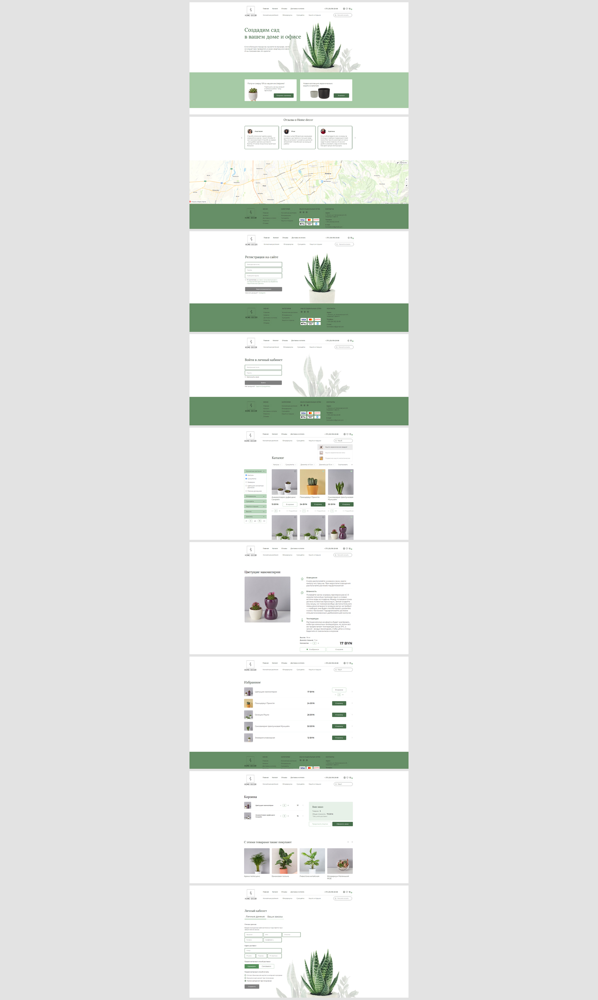

# Веб-приложение - интернет-магазин домашних растений

Интернет-магазин домашних растений  
**Год:** 2022

## Внешний вид

## Реализовано:
- SPA на Angular в соответствии с техническим заданием и макетом;
- Вёрстка всех страниц и компонентов SPA;
- Полный функционал интернет-магазина (регистрация/авторизация, поиск/отображение/детализация/фильтрация/сортировка товаров, добавление в корзину/избранное, личный кабинет);
- Interceptor для удобной работы с jwt-токенами;
- Guards для контроля доступа к контенту;
- Сервисы для управления состояниями компонентов и реализации функционала;

## Возможности:
* Регистрация, авторизация пользователя;
* Просмотр товаров, добавление товаров в избранное и корзину;
* Поиск товаров;
* Фильтрация и сортировка товаров;
* Оформление заказа;
* Заполнение личного кабинета пользователя с указанием его данных для доставки.

## Используемые технологии:
* Angular (HTML, SCSS, TypeScript)
* RxJS
* MongoDB
* JWT-Авторизация
* Postman